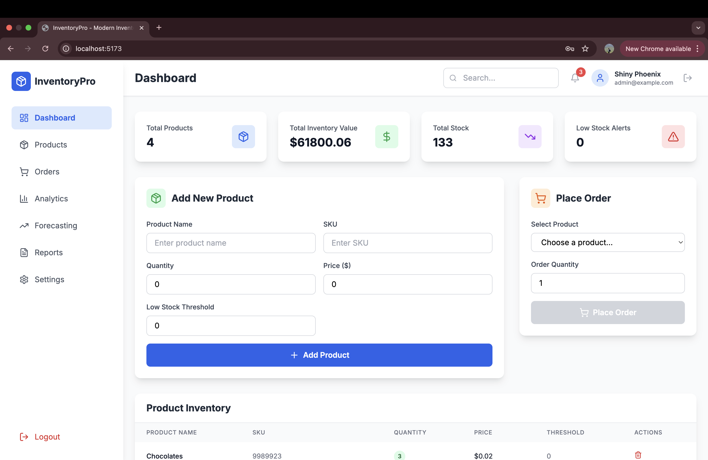
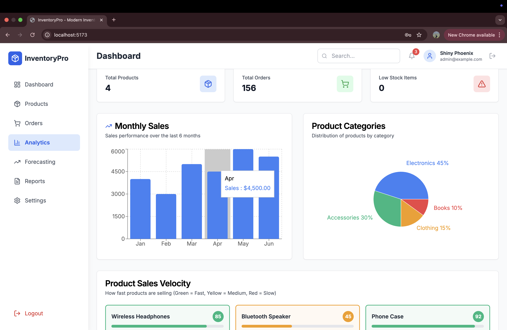

# InventoryPro - Modern Inventory Management Dashboard

A comprehensive, production-ready inventory and order management system built with React, TypeScript, and Supabase.



## 🚀 Features

### 🔐 Authentication & Security
- Email/password authentication via Supabase Auth
- Row Level Security (RLS) for data isolation
- Protected routes and user session management
- Secure logout functionality

### 📦 Product Management
- Complete CRUD operations for inventory items
- Product details: name, SKU, quantity, price, low-stock thresholds
- Real-time stock level monitoring
- Low stock alerts with visual indicators
- Smart restock suggestions with urgency levels

### 🛒 Order Processing
- Place orders that automatically update inventory
- Real-time order history tracking
- Order status management (completed, pending, cancelled)
- Order filtering by date range and status
- Pagination for large order lists




### 📊 Advanced Analytics
- Summary cards with key metrics (total products, orders, low stock items)
- Monthly sales performance charts
- Product category distribution (pie charts)
- Sales velocity heatmaps with color-coded performance
- Interactive data visualizations using Recharts

### 🔮 AI-Powered Forecasting
- 3-month demand predictions using moving average analysis
- Product-specific demand forecasting
- Intelligent restock recommendations
- Predictive analytics with accuracy indicators

### 📈 Business Intelligence
- Custom report generator (PDF, Excel, CSV formats)
- Flexible date range filtering
- Professional report formatting with company branding
- Real-time data export capabilities
- Automated file downloads

### ⚙️ Settings & Configuration
- User profile management
- Password change functionality
- Notification preferences (low stock alerts, order updates)
- Email notification settings
- System configuration options

### 🎨 Modern UI/UX
- Responsive design with mobile-first approach
- Clean, professional interface using Tailwind CSS
- Accessible components with Radix UI
- Smooth animations and micro-interactions
- Consistent design system with proper spacing and typography

## 🛠️ Tech Stack

### Frontend
- **React 18** with TypeScript for type safety
- **Vite** for fast development and building
- **Tailwind CSS** for styling and responsive design
- **Radix UI** for accessible, modern UI components
- **Recharts** for data visualization and charts
- **Lucide React** for consistent iconography

### Backend & Database
- **Supabase** as Backend-as-a-Service
- **PostgreSQL** database with Row Level Security
- **Supabase Auth** for user authentication
- **Real-time subscriptions** for live data updates

### Data Processing & Export
- **jsPDF** + **jsPDF-AutoTable** for PDF generation
- **XLSX** library for Excel file creation
- **Date-fns** for date manipulation
- **Custom utility functions** for data formatting

## 🏗️ Architecture

### Component Structure
```
src/
├── components/           # React components
│   ├── ui/              # Reusable UI components
│   ├── Analytics.tsx    # Business analytics dashboard
│   ├── Dashboard.tsx    # Main dashboard layout
│   ├── OrderHistory.tsx # Order tracking and history
│   └── ...
├── hooks/               # Custom React hooks
│   ├── useAuth.ts       # Authentication state management
│   ├── useProducts.ts   # Product CRUD operations
│   └── useOrders.ts     # Order management
├── lib/                 # Utility libraries
│   ├── supabase.ts      # Supabase client configuration
│   └── utils.ts         # Helper functions
├── data/                # Mock data for demonstrations
└── types/               # TypeScript type definitions
```

### Database Schema
```sql
-- Products table with user isolation
products (
  id, name, sku, quantity, price, threshold, user_id, created_at, updated_at
)

-- Orders table with product relationships
orders (
  id, product_id, quantity, user_id, status, total, created_at
)
```

### Security Features
- **Row Level Security (RLS)**: All data is user-scoped
- **Foreign key relationships**: Proper data integrity
- **Automatic timestamps**: Created/updated tracking
- **Input validation**: Client and server-side validation

## 🚀 Getting Started

### Prerequisites
- Node.js 18+ and npm
- Supabase account and project

### Installation

1. **Clone the repository**
   ```bash
   git clone <repository-url>
   cd inventorypro-dashboard
   ```

2. **Install dependencies**
   ```bash
   npm install
   ```

3. **Set up Supabase**
   - Click "Connect to Supabase" in the top right corner
   - This will automatically configure your environment variables

4. **Run the development server**
   ```bash
   npm run dev
   ```

5. **Build for production**
   ```bash
   npm run build
   ```

### Environment Variables
The following variables are automatically configured when you connect to Supabase:
- `VITE_SUPABASE_URL` - Your Supabase project URL
- `VITE_SUPABASE_ANON_KEY` - Your Supabase anonymous key

## 📱 Features Overview

### Dashboard
- Real-time inventory overview
- Quick product addition
- Order placement interface
- Smart restock suggestions

### Products
- Complete inventory management
- Low stock monitoring
- Bulk operations support

### Orders
- Order placement and tracking
- Historical order analysis
- Status management

### Analytics
- Sales performance metrics
- Product category insights
- Velocity analysis

### Forecasting
- AI-powered demand predictions
- Restock recommendations
- Trend analysis

### Reports
- Custom report generation
- Multiple export formats
- Professional formatting

### Settings
- User account management
- Notification preferences
- System configuration

## 🎯 Key Benefits

- **Production Ready**: Built with enterprise-grade tools and practices
- **Scalable**: Modular architecture supports growth
- **Secure**: Row-level security and proper authentication
- **User-Friendly**: Intuitive interface with modern UX patterns
- **Data-Driven**: Comprehensive analytics and forecasting
- **Flexible**: Customizable reports and configurations
- **Responsive**: Works perfectly on all devices

## 📄 License

This project is licensed under the MIT License - see the LICENSE file for details.

## 🤝 Contributing

Contributions are welcome! Please feel free to submit a Pull Request.

## 📞 Support

For support, please open an issue in the GitHub repository or contact the development team.

---

Built with ❤️ using React, TypeScript, and Supabase